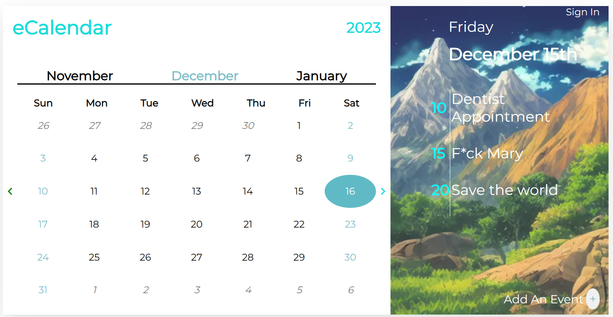
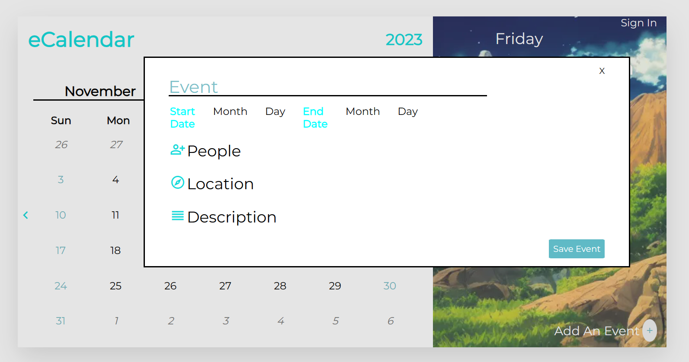

# Hanksenberg Chingu Solo Project - Tier 1 - eCalendar

 

## Overview 

This project is a great opportunity to help me develop a clean and modern webpage. The *eCalendar* app will be completed across tiers, with each tier adding a new level of complexity. I am currently on the **Tier 1 repo**, which means I am responsible for coding the **HTML**, **CSS**, and **JavaScript** to get the structure, styling, and some basic functionality up and running.

**No Frameworks, Libraries, or Code Generators May Be Used In This Tier**

## Instructions

This project is completed with **vanilla** (plain) HTML, CSS, and JavaScript. Do not use front-end frameworks or libraries *(JQuery, Bootstrap, etc.)*.

General instructions for all Pre-Work Projects can also be found in the Chingu Voyage Handbook (URL posted in the #read-me-first channel on Discord).

#### Requirements

*Structure*

- [x] Page divided into calendar potion and event list portion

- [x] Calendar portion to have:  

  - [x] Title and Current year in header  
  - [x] Current month between previous and upcoming month 
  - [x] Calendar dates of the month with display of previous month’s last dates if first day of current month does not start on a Sunday 
  - [x] Arrows bordering the body of the calendar 

- [x] Event portion to have.

  - [x]  Current day of the week displayed  
  - [x]  Current month and date (numerical) displayed  
  - [x]  List of Events with corresponding date of month divided by a vertical bar  
  - [x]  Add event button at bottom 

- [x] *At least* **3** demo events in the event panel portion of the project 

- [x] A modal form activated via button click that floats above the content

*Styling:*

- [x] Colors should match the theming outlined in the demo page 

 - [x] Previous month dates greyed out  `#696868`
 - [x] Current month weekend dates and weekdays separate colors `#7cc0c9` `#839395`
 - [x] Current date highlighted in a circular div `#26B9CC`
 - [x] Gradient over background image (provided in assets folder)
 
 ##### Code for gradient
 ```css
 linear-gradient: linear-gradient(180deg, rgba(209, 226, 188, 0.9) 0%, rgba(255, 255, 255, 0) 100%), rgba(160, 236, 247, 0.5);
 ```

- [x] Use corresponding fonts per section of the calendar page. 
- [ ] Invisible scroll bar for event section
- [x] Utilize the following fonts in the calendar free for use from Google Fonts - *Montserrat, Open Sans* and *Open Sans Condensed*  
      Hints: These fonts are used with multiple font-weights and italics
- [x] Event list should have at minimum three demo events hardcoded in with the date on the *left of the horizontal bar* and the event name *on the right*

*Functionality*

*Upon Load:*

- [x] Calendar will display correct layout of the current month with the weeks starting on Sunday **No month scrolling is required**, only load the current month dates via *vanilla Javascript*
- [x] Will display last dates of previous month if the current month does not start on a Sunday 
- [x] A div will highlight the present day of the month as well as the current weekdate of the month (ex:// on Tuesday the 19th, both *Tues above the calendar dates and the 19th* will have special styling to indicate the present date!)
- [x] All other corresponding theming will match the correct dates according to their place in the week


*Modal Form:*

- [x] Be able to close form without submission and have form close on submission of event information
- [x] Have modal displayed as shown in the demo. This form is **not** expected to be functional.
- [x] Is hidden when not in use


*Other:*

- [x] Your repo needs to have a robust README.md
- [x] Make sure that there are no errors in the developer console before submitting

**Extras (Not Required)**

- [x] Make your design fully responsive *(small/large/portrait/landscape, etc.)*
- [ ] optimized loading of calendar site (hint, consider the background image)

## Example

*The static images below are used to allow for a clear view of both the calendar and modal form*



 
